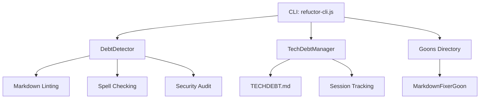
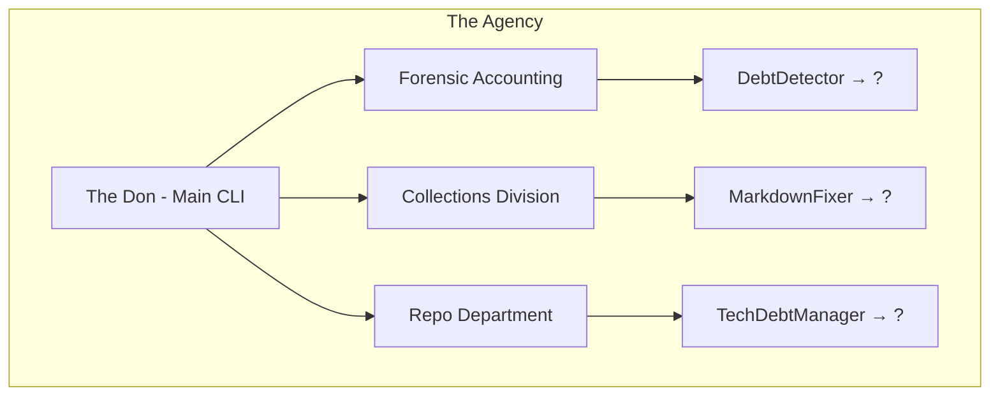
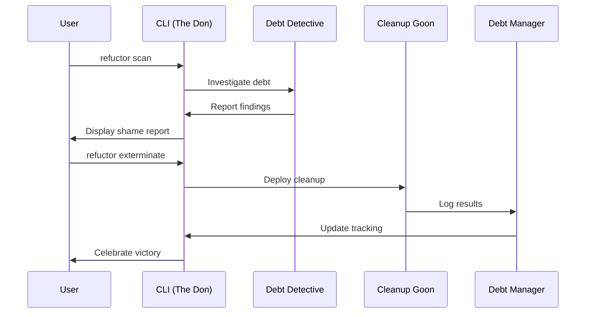

# Refuctor Mythos & Character Bible
# "The Debt Collection Agency Employee Handbook"

> *"Welcome to the Refuctor Debt Collection Agency - where code quality meets organized financial crime. Please check your moral compass at the door."*

---

## 📋 TABLE OF CONTENTS

1. [🔍 CURRENT INVENTORY](#current-inventory) - What we have now
2. [🧠 BRAINSTORMING VAULT](#brainstorming-vault) - Ideas & options to consider
3. [🎭 WORKING MYTHOS](#working-mythos) - Locked-in decisions
4. [🗺️ SYSTEM ARCHITECTURE](#system-architecture) - Visual diagrams
5. [🔧 IMPLEMENTATION ROADMAP](#implementation-roadmap) - What needs to change
6. [📚 REFERENCE LIBRARY](#reference-library) - CLI usage & examples

---

## 🔍 CURRENT INVENTORY

### **📁 File Structure**
```
refuctor/
├── src/
│   ├── debt-detector.js          # Core scanning engine
│   ├── techdebt-manager.js       # TECHDEBT.md management
│   └── goons/
│       └── markdown-fixer.js     # Markdown cleanup specialist
├── cli/
│   └── refuctor-cli.js          # Command-line interface
├── templates/
│   ├── TECHDEBT.md              # Debt tracking template
│   └── TECHDEBT_TEMPLATE.md     # Alternative template
└── package.json                 # NPM package configuration
```

### **🎯 Existing Classes**
| Class Name | File Location | Current Role | Personality Traits |
|------------|---------------|--------------|-------------------|
| `DebtDetector` | `src/debt-detector.js` | Core scanning engine | Clinical, thorough |
| `MarkdownFixerGoon` | `src/goons/markdown-fixer.js` | Document cleanup | "Aggressive document restructuring specialist" |
| `TechDebtManager` | `src/techdebt-manager.js` | TECHDEBT.md handler | Administrative, tracking-focused |

### **⚡ CLI Commands**
| Command | Description | Status | Personality |
|---------|-------------|--------|-------------|
| `refuctor scan` | Detect technical debt | ✅ Working | Investigative, thorough |
| `refuctor status` | Show debt overview | ✅ Working | Administrative, reporting |
| `refuctor init` | Setup debt tracking | ✅ Working | Setup specialist |
| `refuctor shame` | Humorous debt report | ✅ Working | Snarky, humiliating |
| `refuctor bailmeout` | Motivational quotes | ✅ Working | Encouraging (ironically) |
| `refuctor exterminate` | Deploy all goons | ✅ Working | Aggressive, comprehensive |
| `refuctor goon markdown` | Specific markdown fixes | ✅ Working | Specialized cleanup |

### **💰 Debt Classification System**
| Priority | Name | Metaphor | Example Message |
|----------|------|----------|-----------------|
| P1 | Critical - Foreclosure Imminent | Your house is being seized | "This is fucking embarrassing. Fix it NOW." |
| P2 | High - Repossession Notice | Your car is getting towed | "We're taking back the repo. Clean this today." |
| P3 | Medium - Liens Filed | Legal action pending | "A bit crusty. Handle it this sprint." |
| P4 | Low - Interest Accruing | Late fees piling up | "Minor blemish. But you'll pay later…" |

### **🎪 Easter Eggs & Hidden Features**
- `--bailMeOut` - Motivational quotes from failed startups (✅ implemented)
- "After Dark Mode" - Unlocked with 69 clicks (📋 planned)
- Achievement badges for debt reduction milestones (📋 planned)

---

## 🧠 BRAINSTORMING VAULT

### **🏢 ORGANIZATIONAL STRUCTURE IDEAS**

#### **Option A: Corporate Hierarchy**
```
CEO: The Don (main CLI)
├── Department Heads
│   ├── Forensic Accounting (debt analysis)
│   ├── Collections Division (active cleanup)
│   ├── Repo Department (asset seizure)
│   └── Legal Affairs (compliance/rules)
└── Field Agents (individual goons)
```

#### **Option B: Crime Family Structure**
```
The Family
├── Capos (department heads)
├── Soldiers (active tools)
├── Associates (helper functions)
└── Rats (easter eggs/hidden features)
```

#### **Option C: Government Agency Parody**
```
Debt Enforcement Agency (DEA)
├── Investigation Division
├── Tactical Response Team
├── Asset Forfeiture Unit
└── Public Humiliation Department
```

### **👥 CHARACTER CONCEPTS TO EXPAND**

#### **Existing Characters (from previous sessions)**
- **Debt Collector** - Main enforcer (CLI + GUI combo)
- **Accountant** - Debt interest calculator, logs time wasted
- **Fluffer** - Pre-build prep specialist, file cleanup
- **BindStormer** - Detects services bouncing across multiple instances

#### **New Character Ideas**
- **The Appraiser** - Evaluates code quality/value
- **Repo Man** - Asset seizure specialist
- **Loan Shark** - Predatory lending/interest calculations
- **Bailiff** - Court-ordered enforcement
- **Skip Tracer** - Finds hidden/orphaned code
- **Auctioneer** - Liquidation specialist
- **Bankruptcy Attorney** - Nuclear option handler
- **Muscle** - Brute force fixes
- **Bookkeeper** - Documentation maintenance
- **Insurance Adjuster** - Risk assessment

### **🎭 PERSONALITY ARCHETYPES**

#### **The Wise Guys**
- **Tony Soprano Style** - Calm but threatening
- **Joe Pesci Energy** - Manic, unpredictable
- **Accountant Precision** - Obsessively detailed

#### **The Professionals**
- **Corporate Shark** - Smooth, ruthless
- **Government Bureaucrat** - Pedantic, rule-obsessed
- **Repo Man** - Efficient, unemotional

#### **The Wild Cards**
- **Crazy Eddie** - Unpredictable solutions
- **The Cleaner** - Makes problems disappear
- **Old School Enforcer** - "This is how we used to do it"

### **🛠️ TOOL NAMING BRAINSTORM**

#### **Current Tools Needing Names**
1. `DebtDetector` → ?
2. `TechDebtManager` → ?
3. `MarkdownFixerGoon` → ? (already has goon designation)

#### **Future Tools (from roadmap)**
1. `clean-imports` goon → ?
2. `comment-killer` goon → ?
3. `dead-code-hunter` goon → ?
4. `fix-lint` goon → ?

### **💡 CLEVER NAME COMBINATIONS**
- **Pun-based**: DebtFactor, CodeBroker, WarningLoan
- **Role-based**: ChiefEnforcer, HeadCollector, SeniorAuditor
- **Nickname-based**: BigTony, FastEddie, SlowJoey
- **Department-based**: AuditDivision, RepoSquad, CollectionsCrew

---

## 🎭 WORKING MYTHOS
*This section will be populated as we make decisions*

### **🏛️ ORGANIZATION: The Refuctor Debt Collection Agency**

**Mission Statement**: *"We turn your technical debt into our problem, then make it your problem again until you fix it."*

#### **Organizational Chart**
*[Mermaid diagram will go here]*

#### **Department Structure**
*[To be decided based on brainstorming]*

### **👥 CHARACTER PROFILES**
*[Individual character sheets will go here]*

### **🗣️ VOICE & TONE GUIDELINES**
*[Communication standards will go here]*

---

## 🗺️ SYSTEM ARCHITECTURE

### **📊 Current System Overview**



### **🎯 Proposed Character Integration**



### **🔄 Workflow Architecture**



---

## 🔧 IMPLEMENTATION ROADMAP

### **🎯 Phase 1: Character Assignment**
- [ ] Decide on organizational structure
- [ ] Assign personalities to existing tools
- [ ] Rename classes and files
- [ ] Update CLI command descriptions

### **🎯 Phase 2: System Integration**  
- [ ] Update all error messages with character voices
- [ ] Implement department-based help text
- [ ] Add character personalities to output
- [ ] Create character-specific easter eggs

### **🎯 Phase 3: Expansion**
- [ ] Build new goons for remaining debt types
- [ ] Implement department hierarchies
- [ ] Add character interactions/banter
- [ ] Create achievement system

### **📝 Technical Debt Created by Refactoring**
*[Track any issues we create during implementation]*

---

## 📚 REFERENCE LIBRARY

### **🎯 CLI Usage Examples**
*[Will be populated with character-based examples]*

### **🎭 Character Voice Examples**
*[Sample messages for each character]*

### **📖 Terminology Dictionary**
*[Complete glossary of terms and metaphors]*

---

## 🚨 WORKING NOTES & DECISIONS

### **Session Notes**
- User wants to go VERY dark but keep it funny
- Different departments/roles are key to cleverness
- Names should be punchy, memorable, and relate to function
- Retrofit everything now, fix tech debt as we go
- Slight personalities for humor but not too much bloat

### **Key Principles**
1. **Function First** - Names must make sense for what the tool does
2. **Memorable & Clever** - Bonus points if people giggle
3. **Dark but Funny** - Push boundaries but keep it humorous
4. **Cohesive Universe** - Everything fits the debt collection theme
5. **Professional Functionality** - Don't sacrifice utility for humor

---

*"Remember: In the Debt Collection Agency, everyone pays eventually."* 