# Refuctor System Architecture & Complete Roadmap

> **"The Debt Cleansing Syndicate - Complete Visual Roadmap for Humanzees"**

**Status**: Phase 1 CLI Foundation ✅ COMPLETE | Phase 2-5 📋 PLANNED  
**Version**: 0.1.0-beta.1  
**Last Updated**: January 3, 2025

---

## 🎯 Complete System Overview - All Phases

Refuctor's evolution from CLI tool to comprehensive debt management ecosystem across 5 phases.

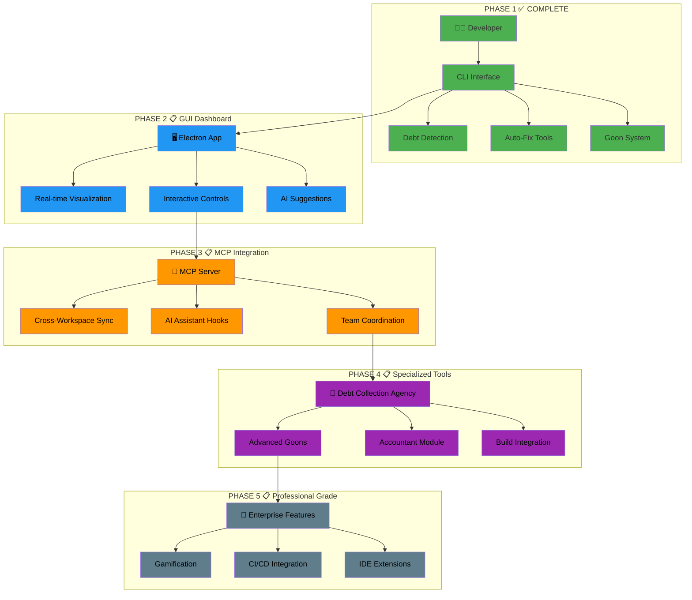
```mermaid
graph TB
    subgraph "PHASE 1 ✅ COMPLETE"
        A1["🧑‍💻 Developer"] --> B1["CLI Interface"]
        B1 --> C1["Debt Detection"]
        B1 --> D1["Auto-Fix Tools"]
        B1 --> E1["Goon System"]
    end
    
    subgraph "PHASE 2 📋 GUI Dashboard"
        A2["🖥️ Electron App"] --> B2["Real-time Visualization"]
        A2 --> C2["Interactive Controls"]
        A2 --> D2["AI Suggestions"]
    end
    
    subgraph "PHASE 3 📋 MCP Integration"
        A3["🔌 MCP Server"] --> B3["Cross-Workspace Sync"]
        A3 --> C3["AI Assistant Hooks"]
        A3 --> D3["Team Coordination"]
    end
    
    subgraph "PHASE 4 📋 Specialized Tools"
        A4["👥 Debt Collection Agency"] --> B4["Advanced Goons"]
        A4 --> C4["Accountant Module"]
        A4 --> D4["Build Integration"]
    end
    
    subgraph "PHASE 5 📋 Professional Grade"
        A5["🎨 Enterprise Features"] --> B5["Gamification"]
        A5 --> C5["CI/CD Integration"]
        A5 --> D5["IDE Extensions"]
    end
    
    B1 --> A2
    C2 --> A3
    D3 --> A4
    B4 --> A5
    
    style A1 fill:#4caf50
    style B1 fill:#4caf50
    style C1 fill:#4caf50
    style D1 fill:#4caf50
    style E1 fill:#4caf50
    
    style A2 fill:#2196f3,color:#000000
    style B2 fill:#2196f3,color:#000000
    style C2 fill:#2196f3,color:#000000
    style D2 fill:#2196f3,color:#000000
    
    style A3 fill:#ff9800,color:#000000
    style B3 fill:#ff9800,color:#000000
    style C3 fill:#ff9800,color:#000000
    style D3 fill:#ff9800,color:#000000
    
    style A4 fill:#9c27b0,color:#000000
    style B4 fill:#9c27b0,color:#000000
    style C4 fill:#9c27b0,color:#000000
    style D4 fill:#9c27b0,color:#000000
    
    style A5 fill:#607d8b,color:#000000
    style B5 fill:#607d8b,color:#000000
    style C5 fill:#607d8b,color:#000000
    style D5 fill:#607d8b,color:#000000
```

---

## 🏗️ Core Architecture

### **File Structure (Actual Implementation)**

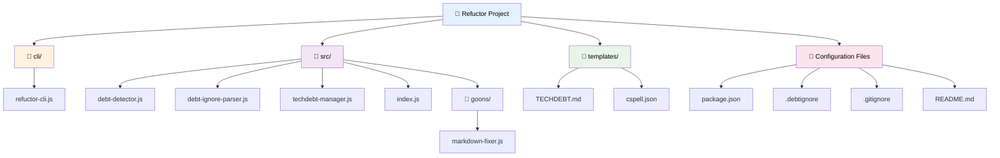
```mermaid
graph TD
    A["📁 Refuctor Project"] --> B["📁 cli/"]
    A --> C["📁 src/"]
    A --> D["📁 templates/"]
    A --> E["📄 Configuration Files"]
    
    B --> B1["refuctor-cli.js"]
    
    C --> C1["debt-detector.js"]
    C --> C2["debt-ignore-parser.js"]
    C --> C3["techdebt-manager.js"]
    C --> C4["index.js"]
    C --> C5["📁 goons/"]
    
    C5 --> C51["markdown-fixer.js"]
    
    D --> D1["TECHDEBT.md"]
    D --> D2["cspell.json"]
    
    E --> E1["package.json"]
    E --> E2[".debtignore"]
    E --> E3[".gitignore"]
    E --> E4["README.md"]
    
    style A fill:#e3f2fd,color:#000000
    style B fill:#fff3e0,color:#000000
    style C fill:#f3e5f5,color:#000000
    style D fill:#e8f5e8,color:#000000
    style E fill:#fce4ec,color:#000000
```

---

## ⚡ CLI Command Architecture - Phase 1 Complete

### **PHASE 1 ✅ Complete Command Structure (11 Commands)**

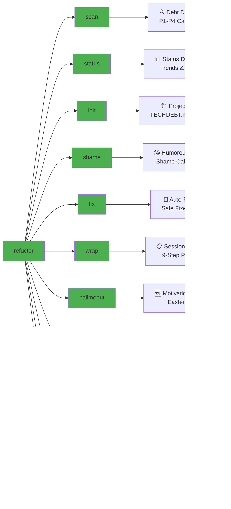
```mermaid
graph LR
    A["refuctor"] --> B1["scan"]
    A --> B2["status"]
    A --> B3["init"]
    A --> B4["shame"]
    A --> B5["fix"]
    A --> B6["wrap"]
    A --> B7["bailmeout"]
    A --> B8["goon"]
    A --> B9["exterminate"]
    A --> B10["dependencies"]
    A --> B11["ignore"]
    
    B1 --> C1["🔍 Debt Detection<br/>P1-P4 Categories"]
    B2 --> C2["📊 Status Dashboard<br/>Trends & Metrics"]
    B3 --> C3["🏗️ Project Setup<br/>TECHDEBT.md Creation"]
    B4 --> C4["😱 Humorous Reports<br/>Shame Calculations"]
    B5 --> C5["🔧 Auto-Repair<br/>Safe Fixes Only"]
    B6 --> C6["📋 Session Protocol<br/>9-Step Process"]
    B7 --> C7["🆘 Motivation Quotes<br/>Easter Egg"]
    B8 --> C8["💀 Specialized Tools<br/>fix-markdown"]
    B9 --> C9["🔥 Mass Elimination<br/>Deploy All Goons"]
    B10 --> C10["📦 Dependency Check<br/>Missing Packages"]
    B11 --> C11["🚫 Ignore Management<br/>.debtignore System"]
    
    style A fill:#4caf50
    style B1 fill:#4caf50
    style B2 fill:#4caf50
    style B3 fill:#4caf50
    style B4 fill:#4caf50
    style B5 fill:#4caf50
    style B6 fill:#4caf50
    style B7 fill:#4caf50
    style B8 fill:#4caf50
    style B9 fill:#4caf50
    style B10 fill:#4caf50
    style B11 fill:#4caf50
```

---

## 🖥️ Phase 2: GUI Dashboard Architecture

### **Electron Desktop Application**

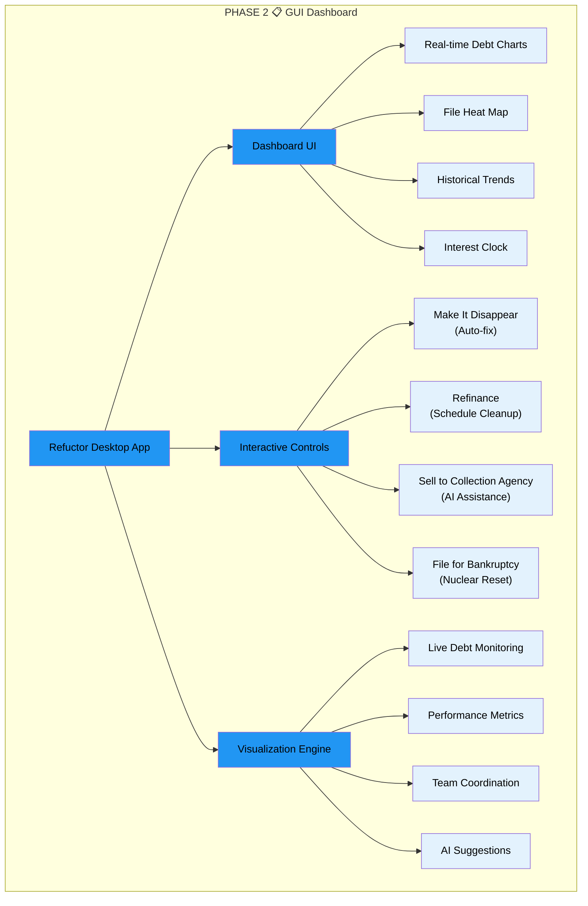
```mermaid
graph TB
    subgraph "PHASE 2 📋 GUI Dashboard"
        A["Refuctor Desktop App"] --> B["Dashboard UI"]
        A --> C["Interactive Controls"]
        A --> D["Visualization Engine"]
        
        B --> B1["Real-time Debt Charts"]
        B --> B2["File Heat Map"]
        B --> B3["Historical Trends"]
        B --> B4["Interest Clock"]
        
        C --> C1["Make It Disappear<br/>(Auto-fix)"]
        C --> C2["Refinance<br/>(Schedule Cleanup)"]
        C --> C3["Sell to Collection Agency<br/>(AI Assistance)"]
        C --> C4["File for Bankruptcy<br/>(Nuclear Reset)"]
        
        D --> D1["Live Debt Monitoring"]
        D --> D2["Performance Metrics"]
        D --> D3["Team Coordination"]
        D --> D4["AI Suggestions"]
    end
    
    style A fill:#2196f3,color:#000000
    style B fill:#2196f3,color:#000000
    style C fill:#2196f3,color:#000000
    style D fill:#2196f3,color:#000000
    style B1 fill:#e3f2fd,color:#000000
    style B2 fill:#e3f2fd,color:#000000
    style B3 fill:#e3f2fd,color:#000000
    style B4 fill:#e3f2fd,color:#000000
    style C1 fill:#e3f2fd,color:#000000
    style C2 fill:#e3f2fd,color:#000000
    style C3 fill:#e3f2fd,color:#000000
    style C4 fill:#e3f2fd,color:#000000
    style D1 fill:#e3f2fd,color:#000000
    style D2 fill:#e3f2fd,color:#000000
    style D3 fill:#e3f2fd,color:#000000
    style D4 fill:#e3f2fd,color:#000000
```

---

## 🔌 Phase 3: MCP Integration Architecture

### **Model Context Protocol & AI Integration**

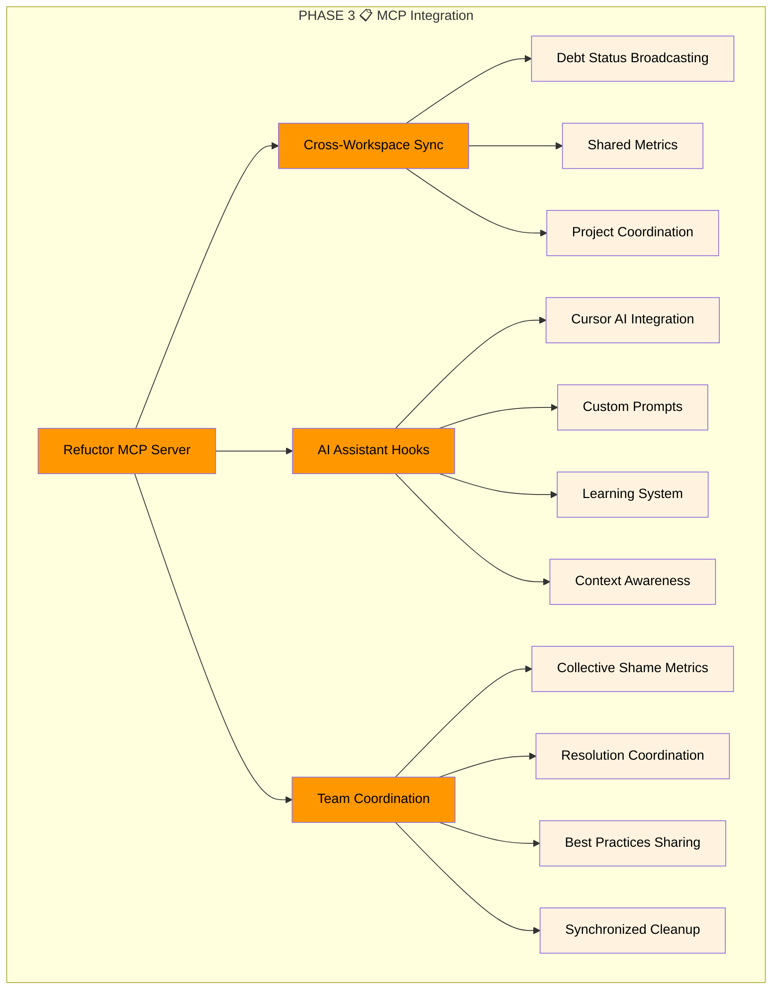
```mermaid
graph TB
    subgraph "PHASE 3 📋 MCP Integration"
        A["Refuctor MCP Server"] --> B["Cross-Workspace Sync"]
        A --> C["AI Assistant Hooks"]
        A --> D["Team Coordination"]
        
        B --> B1["Debt Status Broadcasting"]
        B --> B2["Shared Metrics"]
        B --> B3["Project Coordination"]
        
        C --> C1["Cursor AI Integration"]
        C --> C2["Custom Prompts"]
        C --> C3["Learning System"]
        C --> C4["Context Awareness"]
        
        D --> D1["Collective Shame Metrics"]
        D --> D2["Resolution Coordination"]
        D --> D3["Best Practices Sharing"]
        D --> D4["Synchronized Cleanup"]
    end
    
    style A fill:#ff9800,color:#000000
    style B fill:#ff9800,color:#000000
    style C fill:#ff9800,color:#000000
    style D fill:#ff9800,color:#000000
    style B1 fill:#fff3e0,color:#000000
    style B2 fill:#fff3e0,color:#000000
    style B3 fill:#fff3e0,color:#000000
    style C1 fill:#fff3e0,color:#000000
    style C2 fill:#fff3e0,color:#000000
    style C3 fill:#fff3e0,color:#000000
    style C4 fill:#fff3e0,color:#000000
    style D1 fill:#fff3e0,color:#000000
    style D2 fill:#fff3e0,color:#000000
    style D3 fill:#fff3e0,color:#000000
    style D4 fill:#fff3e0,color:#000000
```

---

## 🎨 Phase 5: Enterprise & Polish Features

### **Professional Grade Features**

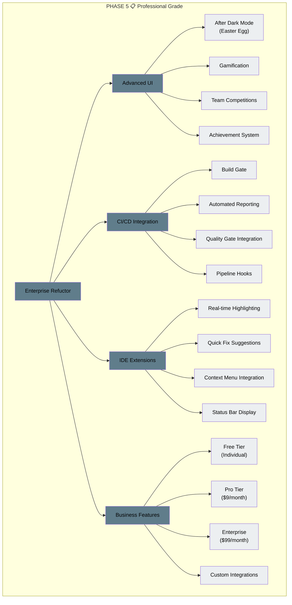
```mermaid
graph TB
    subgraph "PHASE 5 📋 Professional Grade"
        A["Enterprise Refuctor"] --> B["Advanced UI"]
        A --> C["CI/CD Integration"]
        A --> D["IDE Extensions"]
        A --> E["Business Features"]
        
        B --> B1["After Dark Mode<br/>(Easter Egg)"]
        B --> B2["Gamification"]
        B --> B3["Team Competitions"]
        B --> B4["Achievement System"]
        
        C --> C1["Build Gate"]
        C --> C2["Automated Reporting"]
        C --> C3["Quality Gate Integration"]
        C --> C4["Pipeline Hooks"]
        
        D --> D1["Real-time Highlighting"]
        D --> D2["Quick Fix Suggestions"]
        D --> D3["Context Menu Integration"]
        D --> D4["Status Bar Display"]
        
        E --> E1["Free Tier<br/>(Individual)"]
        E --> E2["Pro Tier<br/>($9/month)"]
        E --> E3["Enterprise<br/>($99/month)"]
        E --> E4["Custom Integrations"]
    end
    
    style A fill:#607d8b,color:#000000
    style B fill:#607d8b,color:#000000
    style C fill:#607d8b,color:#000000
    style D fill:#607d8b,color:#000000
    style E fill:#607d8b,color:#000000
    style B1 fill:#eceff1,color:#000000
    style B2 fill:#eceff1,color:#000000
    style B3 fill:#eceff1,color:#000000
    style B4 fill:#eceff1,color:#000000
    style C1 fill:#eceff1,color:#000000
    style C2 fill:#eceff1,color:#000000
    style C3 fill:#eceff1,color:#000000
    style C4 fill:#eceff1,color:#000000
    style D1 fill:#eceff1,color:#000000
    style D2 fill:#eceff1,color:#000000
    style D3 fill:#eceff1,color:#000000
    style D4 fill:#eceff1,color:#000000
    style E1 fill:#eceff1,color:#000000
    style E2 fill:#eceff1,color:#000000
    style E3 fill:#eceff1,color:#000000
    style E4 fill:#eceff1,color:#000000
```

---

## 🛠️ Phase 4: Specialized Tools & Debt Collection Agency

### **The Complete Debt Collection Ecosystem**

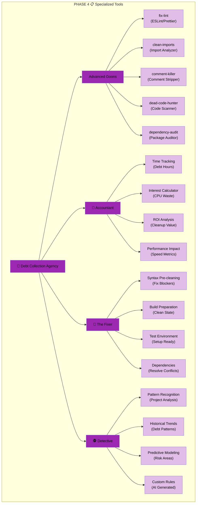
```mermaid
graph TB
    subgraph "PHASE 4 📋 Specialized Tools"
        A["👥 Debt Collection Agency"] --> B["Advanced Goons"]
        A --> C["👔 Accountant"]
        A --> D["🔧 The Fixer"]
        A --> E["🕵️ Detective"]
        
        B --> B1["fix-lint<br/>(ESLint/Prettier)"]
        B --> B2["clean-imports<br/>(Import Analyzer)"]
        B --> B3["comment-killer<br/>(Comment Stripper)"]
        B --> B4["dead-code-hunter<br/>(Code Scanner)"]
        B --> B5["dependency-audit<br/>(Package Auditor)"]
        
        C --> C1["Time Tracking<br/>(Debt Hours)"]
        C --> C2["Interest Calculator<br/>(CPU Waste)"]
        C --> C3["ROI Analysis<br/>(Cleanup Value)"]
        C --> C4["Performance Impact<br/>(Speed Metrics)"]
        
        D --> D1["Syntax Pre-cleaning<br/>(Fix Blockers)"]
        D --> D2["Build Preparation<br/>(Clean State)"]
        D --> D3["Test Environment<br/>(Setup Ready)"]
        D --> D4["Dependencies<br/>(Resolve Conflicts)"]
        
        E --> E1["Pattern Recognition<br/>(Project Analysis)"]
        E --> E2["Historical Trends<br/>(Debt Patterns)"]
        E --> E3["Predictive Modeling<br/>(Risk Areas)"]
        E --> E4["Custom Rules<br/>(AI Generated)"]
    end
    
    style A fill:#9c27b0,color:#000000
    style B fill:#9c27b0,color:#000000
    style C fill:#9c27b0,color:#000000
    style D fill:#9c27b0,color:#000000
    style E fill:#9c27b0,color:#000000
    
    style B1 fill:#e1bee7,color:#000000
    style B2 fill:#e1bee7,color:#000000
    style B3 fill:#e1bee7,color:#000000
    style B4 fill:#e1bee7,color:#000000
    style B5 fill:#e1bee7,color:#000000
    
    style C1 fill:#e1bee7,color:#000000
    style C2 fill:#e1bee7,color:#000000
    style C3 fill:#e1bee7,color:#000000
    style C4 fill:#e1bee7,color:#000000
    
    style D1 fill:#e1bee7,color:#000000
    style D2 fill:#e1bee7,color:#000000
    style D3 fill:#e1bee7,color:#000000
    style D4 fill:#e1bee7,color:#000000
    
    style E1 fill:#e1bee7,color:#000000
    style E2 fill:#e1bee7,color:#000000
    style E3 fill:#e1bee7,color:#000000
    style E4 fill:#e1bee7,color:#000000
```

---

## 🔍 Debt Detection Process

### **How `refuctor scan` Works**

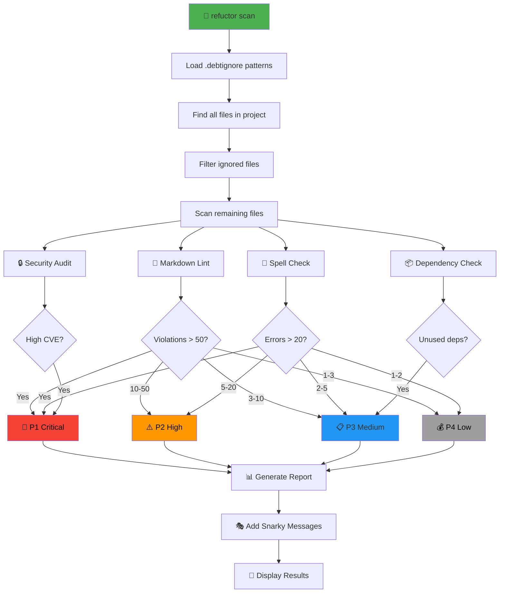
```mermaid
flowchart TD
    A["🚀 refuctor scan"] --> B["Load .debtignore patterns"]
    B --> C["Find all files in project"]
    C --> D["Filter ignored files"]
    D --> E["Scan remaining files"]
    
    E --> F["📝 Markdown Lint"]
    E --> G["📖 Spell Check"]
    E --> H["🔒 Security Audit"]
    E --> I["📦 Dependency Check"]
    
    F --> J{"Violations > 50?"}
    G --> K{"Errors > 20?"}
    H --> L{"High CVE?"}
    I --> M{"Unused deps?"}
    
    J -->|Yes| N["🚨 P1 Critical"]
    J -->|10-50| O["⚠️ P2 High"]
    J -->|3-10| P["📋 P3 Medium"]
    J -->|1-3| Q["💰 P4 Low"]
    
    K -->|Yes| N
    K -->|5-20| O
    K -->|2-5| P
    K -->|1-2| Q
    
    L -->|Yes| N
    M -->|Yes| P
    
    N --> R["📊 Generate Report"]
    O --> R
    P --> R
    Q --> R
    R --> S["🎭 Add Snarky Messages"]
    S --> T["💬 Display Results"]
    
    style A fill:#4caf50
    style N fill:#f44336,color:#000000
    style O fill:#ff9800,color:#000000
    style P fill:#2196f3
    style Q fill:#9e9e9e,color:#000000
```

---

## 🚫 Debt Ignore System

### **How `.debtignore` Works**

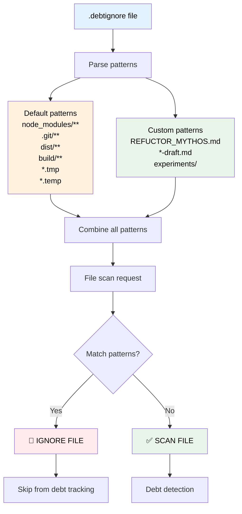
```mermaid
flowchart TD
    A[".debtignore file"] --> B["Parse patterns"]
    B --> C["Default patterns<br/>node_modules/**<br/>.git/**<br/>dist/**<br/>build/**<br/>*.tmp<br/>*.temp"]
    B --> D["Custom patterns<br/>REFUCTOR_MYTHOS.md<br/>*-draft.md<br/>experiments/"]
    
    C --> E["Combine all patterns"]
    D --> E
    E --> F["File scan request"]
    F --> G{"Match patterns?"}
    G -->|Yes| H["🚫 IGNORE FILE"]
    G -->|No| I["✅ SCAN FILE"]
    
    I --> J["Debt detection"]
    H --> K["Skip from debt tracking"]
    
    style A fill:#e3f2fd,color:#000000
    style C fill:#fff3e0,color:#000000
    style D fill:#e8f5e8,color:#000000
    style H fill:#ffebee,color:#000000
    style I fill:#e8f5e8,color:#000000
```

### **Ignore Management Commands**

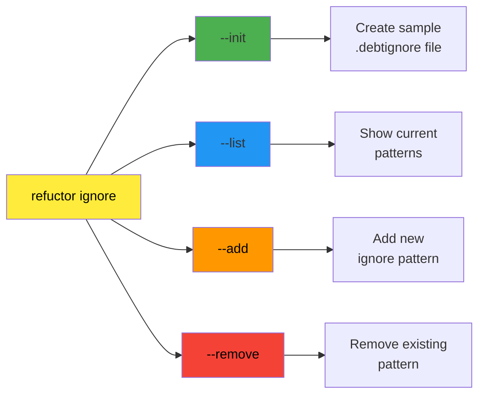
```mermaid
graph LR
    A["refuctor ignore"] --> B1["--init"]
    A --> B2["--list"]
    A --> B3["--add <pattern>"]
    A --> B4["--remove <pattern>"]
    
    B1 --> C1["Create sample<br/>.debtignore file"]
    B2 --> C2["Show current<br/>patterns"]
    B3 --> C3["Add new<br/>ignore pattern"]
    B4 --> C4["Remove existing<br/>pattern"]
    
    style A fill:#ffeb3b,color:#000000
    style B1 fill:#4caf50
    style B2 fill:#2196f3
    style B3 fill:#ff9800,color:#000000
    style B4 fill:#f44336,color:#000000
```

---

## 💀 Complete Goon Arsenal - All Phases

### **The Debt Collection Agency Evolution**

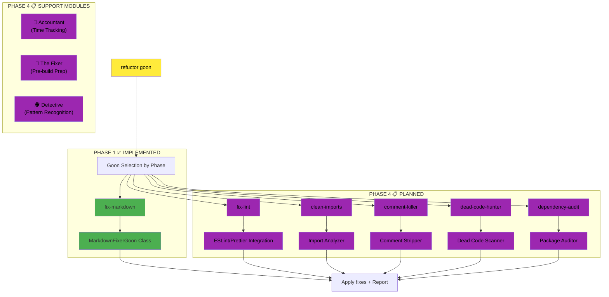
```mermaid
flowchart TD
    A["refuctor goon"] --> B["Goon Selection by Phase"]
    
    subgraph "PHASE 1 ✅ IMPLEMENTED"
        B --> C1["fix-markdown"]
        C1 --> G1["MarkdownFixerGoon Class"]
    end
    
    subgraph "PHASE 4 📋 PLANNED"
        B --> C2["fix-lint"]
        B --> C3["clean-imports"] 
        B --> C4["comment-killer"]
        B --> C5["dead-code-hunter"]
        B --> C6["dependency-audit"]
        
        C2 --> G2["ESLint/Prettier Integration"]
        C3 --> G3["Import Analyzer"]
        C4 --> G4["Comment Stripper"]
        C5 --> G5["Dead Code Scanner"]
        C6 --> G6["Package Auditor"]
    end
    
    subgraph "PHASE 4 📋 SUPPORT MODULES"
        H1["👔 Accountant<br/>(Time Tracking)"]
        H2["🔧 The Fixer<br/>(Pre-build Prep)"]
        H3["🕵️ Detective<br/>(Pattern Recognition)"]
    end
    
    G1 --> I["Apply fixes + Report"]
    G2 --> I
    G3 --> I 
    G4 --> I
    G5 --> I
    G6 --> I
    
    style A fill:#ffeb3b,color:#000000
    style C1 fill:#4caf50
    style G1 fill:#4caf50
    
    style C2 fill:#9c27b0,color:#000000
    style C3 fill:#9c27b0,color:#000000
    style C4 fill:#9c27b0,color:#000000
    style C5 fill:#9c27b0,color:#000000
    style C6 fill:#9c27b0,color:#000000
    style G2 fill:#9c27b0,color:#000000
    style G3 fill:#9c27b0,color:#000000
    style G4 fill:#9c27b0,color:#000000
    style G5 fill:#9c27b0,color:#000000
    style G6 fill:#9c27b0,color:#000000
    
    style H1 fill:#9c27b0,color:#000000
    style H2 fill:#9c27b0,color:#000000
    style H3 fill:#9c27b0,color:#000000
```

---

## 🔧 Auto-Fix Process

### **How `refuctor fix` Works**

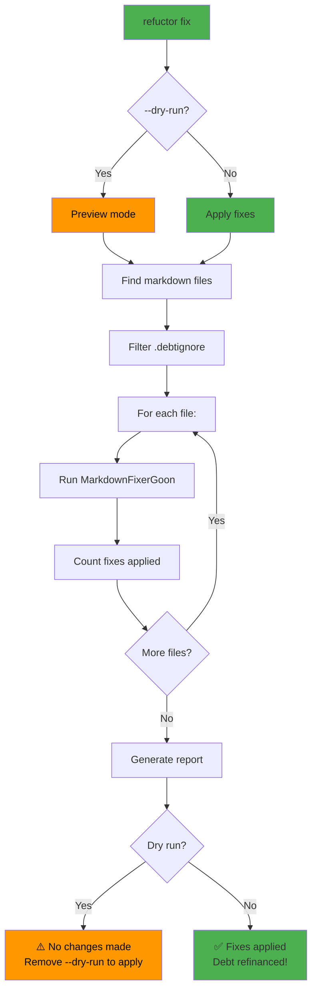
```mermaid
flowchart TD
    A["refuctor fix"] --> B{"--dry-run?"}
    B -->|Yes| C["Preview mode"]
    B -->|No| D["Apply fixes"]
    
    C --> E["Find markdown files"]
    D --> E
    E --> F["Filter .debtignore"]
    F --> G["For each file:"]
    G --> H["Run MarkdownFixerGoon"]
    H --> I["Count fixes applied"]
    I --> J{"More files?"}
    J -->|Yes| G
    J -->|No| K["Generate report"]
    
    K --> L{"Dry run?"}
    L -->|Yes| M["⚠️ No changes made<br/>Remove --dry-run to apply"]
    L -->|No| N["✅ Fixes applied<br/>Debt refinanced!"]
    
    style A fill:#4caf50
    style C fill:#ff9800,color:#000000
    style D fill:#4caf50
    style M fill:#ff9800,color:#000000
    style N fill:#4caf50
```

---

## 📋 Session Wrap Protocol

### **9-Step Process (`refuctor wrap`)**

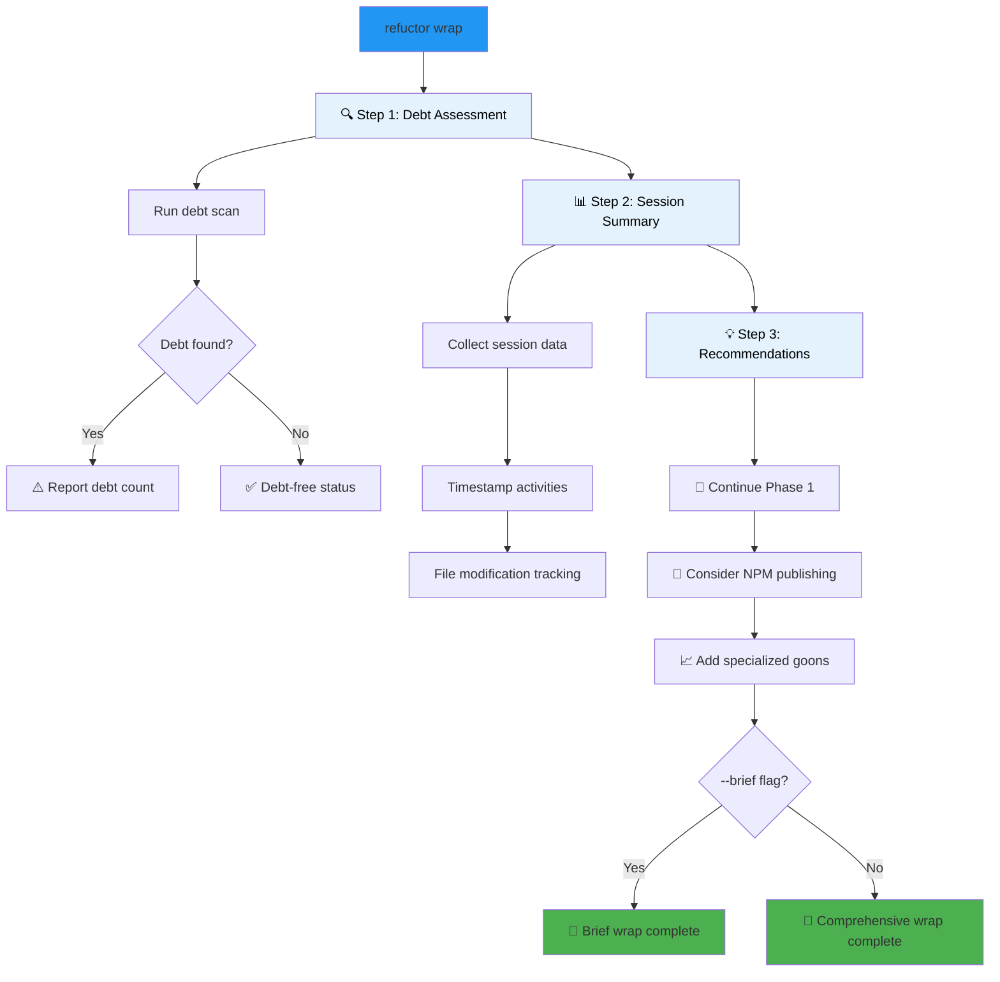
```mermaid
flowchart TD
    A["refuctor wrap"] --> B["🔍 Step 1: Debt Assessment"]
    B --> C["📊 Step 2: Session Summary"]
    C --> D["💡 Step 3: Recommendations"]
    
    B --> B1["Run debt scan"]
    B1 --> B2{"Debt found?"}
    B2 -->|Yes| B3["⚠️ Report debt count"]
    B2 -->|No| B4["✅ Debt-free status"]
    
    C --> C1["Collect session data"]
    C1 --> C2["Timestamp activities"]
    C2 --> C3["File modification tracking"]
    
    D --> D1["🎯 Continue Phase 1"]
    D1 --> D2["🚀 Consider NPM publishing"]
    D2 --> D3["📈 Add specialized goons"]
    
    D3 --> E{"--brief flag?"}
    E -->|Yes| F["📝 Brief wrap complete"]
    E -->|No| G["📝 Comprehensive wrap complete"]
    
    style A fill:#2196f3
    style B fill:#e3f2fd,color:#000000
    style C fill:#e3f2fd,color:#000000
    style D fill:#e3f2fd,color:#000000
    style F fill:#4caf50
    style G fill:#4caf50
```

---

## 💳 Credit Rating & Financial System

### **Developer Credit Score Algorithm**

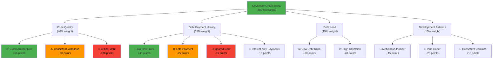
```mermaid
graph TD
    A["Developer Credit Score<br/>(300-850 range)"] --> B["Code Quality<br/>(40% weight)"]
    A --> C["Debt Payment History<br/>(35% weight)"]
    A --> D["Debt Load<br/>(15% weight)"]
    A --> E["Development Patterns<br/>(10% weight)"]
    
    B --> B1["✅ Clean Architecture<br/>+50 points"]
    B --> B2["⚠️ Consistent Violations<br/>-30 points"]
    B --> B3["🚨 Critical Debt<br/>-100 points"]
    
    C --> C1["💚 On-time Fixes<br/>+40 points"]
    C --> C2["🟡 Late Payment<br/>-25 points"]
    C --> C3["🔴 Ignored Debt<br/>-75 points"]
    C --> C4["💸 Interest-only Payments<br/>-15 points"]
    
    D --> D1["📊 Low Debt Ratio<br/>+20 points"]
    D --> D2["📈 High Utilization<br/>-40 points"]
    
    E --> E1["🎯 Meticulous Planner<br/>+15 points"]
    E --> E2["🎲 Vibe Coder<br/>-25 points"]
    E --> E3["🔄 Consistent Commits<br/>+10 points"]
    
    style A fill:#4caf50
    style B1 fill:#4caf50
    style C1 fill:#4caf50
    style B2 fill:#ff9800,color:#000000
    style C2 fill:#ff9800,color:#000000
    style B3 fill:#f44336,color:#000000
    style C3 fill:#f44336,color:#000000
```

### **Interest Rate Tiers Based on Developer Profile**

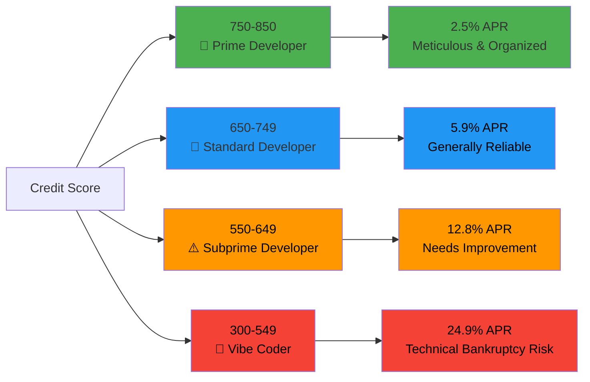
```mermaid
graph LR
    A["Credit Score"] --> B["750-850<br/>🌟 Prime Developer"]
    A --> C["650-749<br/>💼 Standard Developer"]
    A --> D["550-649<br/>⚠️ Subprime Developer"]
    A --> E["300-549<br/>🚨 Vibe Coder"]
    
    B --> B1["2.5% APR<br/>Meticulous & Organized"]
    C --> C1["5.9% APR<br/>Generally Reliable"]
    D --> D1["12.8% APR<br/>Needs Improvement"]
    E --> E1["24.9% APR<br/>Technical Bankruptcy Risk"]
    
    style B fill:#4caf50
    style B1 fill:#4caf50
    style C fill:#2196f3
    style C1 fill:#2196f3,color:#000000
    style D fill:#ff9800,color:#000000
    style D1 fill:#ff9800,color:#000000
    style E fill:#f44336,color:#000000
    style E1 fill:#f44336,color:#000000
```

### **Payment History & Debt Management**

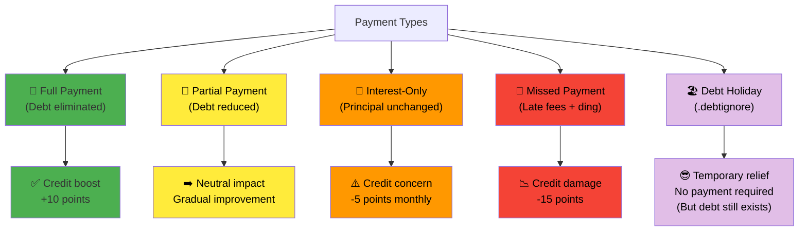
```mermaid
graph TD
    A["Payment Types"] --> B["💚 Full Payment<br/>(Debt eliminated)"]
    A --> C["💛 Partial Payment<br/>(Debt reduced)"]
    A --> D["💸 Interest-Only<br/>(Principal unchanged)"]
    A --> E["🔴 Missed Payment<br/>(Late fees + ding)"]
    A --> F["🏖️ Debt Holiday<br/>(.debtignore)"]
    
    B --> B1["✅ Credit boost<br/>+10 points"]
    C --> C1["➡️ Neutral impact<br/>Gradual improvement"]
    D --> D1["⚠️ Credit concern<br/>-5 points monthly"]
    E --> E1["📉 Credit damage<br/>-15 points"]
    F --> F1["😎 Temporary relief<br/>No payment required<br/>(But debt still exists)"]
    
    style B fill:#4caf50
    style B1 fill:#4caf50
    style C fill:#ffeb3b,color:#000000
    style C1 fill:#ffeb3b,color:#000000
    style D fill:#ff9800,color:#000000
    style D1 fill:#ff9800,color:#000000
    style E fill:#f44336,color:#000000
    style E1 fill:#f44336,color:#000000
    style F fill:#e1bee7,color:#000000
    style F1 fill:#e1bee7,color:#000000
```

### **Web Dashboard Financial Metrics**

**Real-time Credit Monitoring Features:**
- **Credit Score Tracker**: Live 300-850 score with trend indicators
- **Interest Rate Calculator**: Dynamic APR based on current coding patterns  
- **Payment History Timeline**: Visual debt payment record with late payment flags
- **Debt-to-Income Ratio**: Technical debt vs. productive code metrics
- **Credit Utilization**: Current debt load vs. maximum sustainable debt threshold
- **Payment Recommendations**: "Make minimum payment" vs. "Pay off high-interest debt first"
- **Debt Consolidation Alerts**: Suggest refactoring opportunities for multiple related issues

### **🕴️ Mafia Takeover → 🤌 Guido Escalation Hierarchy**

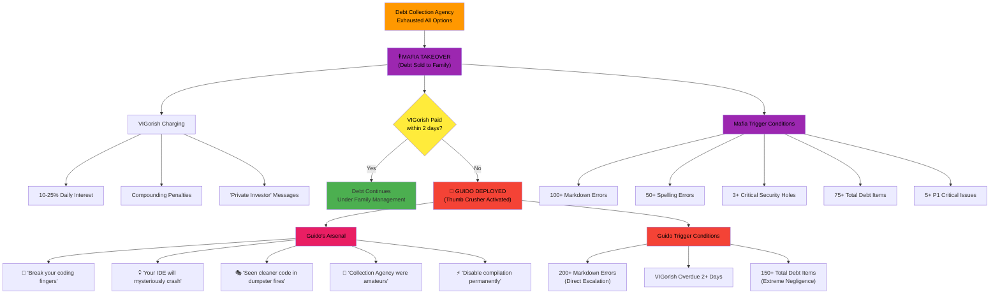
```mermaid
graph TD
    A["Debt Collection Agency<br/>Exhausted All Options"] --> B["🕴️ MAFIA TAKEOVER<br/>(Debt Sold to Family)"]
    
    B --> B1["VIGorish Charging"]
    B1 --> B2["10-25% Daily Interest"]
    B1 --> B3["Compounding Penalties"]
    B1 --> B4["'Private Investor' Messages"]
    
    B --> C{"VIGorish Paid<br/>within 2 days?"}
    C -->|Yes| D["Debt Continues<br/>Under Family Management"]
    C -->|No| E["🤌 GUIDO DEPLOYED<br/>(Thumb Crusher Activated)"]
    
    E --> F["Guido's Arsenal"]
    F --> F1["🔨 'Break your coding fingers'"]
    F --> F2["💀 'Your IDE will mysteriously crash'"]
    F --> F3["🎭 'Seen cleaner code in dumpster fires'"]
    F --> F4["💸 'Collection Agency were amateurs'"]
    F --> F5["⚡ 'Disable compilation permanently'"]
    
    B --> G["Mafia Trigger Conditions"]
    G --> G1["100+ Markdown Errors"]
    G --> G2["50+ Spelling Errors"]
    G --> G3["3+ Critical Security Holes"]
    G --> G4["75+ Total Debt Items"]
    G --> G5["5+ P1 Critical Issues"]
    
    E --> H["Guido Trigger Conditions"]
    H --> H1["200+ Markdown Errors<br/>(Direct Escalation)"]
    H --> H2["VIGorish Overdue 2+ Days"]
    H --> H3["150+ Total Debt Items<br/>(Extreme Negligence)"]
    
    style A fill:#ff9800,color:#000000
    style B fill:#9c27b0,color:#000000
    style E fill:#f44336,color:#000000
    style C fill:#ffeb3b,color:#000000
    style D fill:#4caf50
    style F fill:#e91e63,color:#000000
    style G fill:#9c27b0,color:#000000
    style H fill:#f44336,color:#000000
```

**Mafia Philosophy:**
*"The Collection Agency couldn't handle your debt, so they sold it to us. Welcome to the big leagues. VIGorish is 20% daily, compounded. Don't make us send Guido."*

**Guido's Philosophy:**
*"When the Family can't collect VIGorish, they call me. I don't just repo code - I repo fingers. Capisce?"*

**Escalation Timeline:**
1. **P4 → P3 → P2 → P1**: Normal Collection Agency operations
2. **🕴️ MAFIA TAKEOVER**: Debt sold to "private investors", VIGorish charging begins
3. **🤌 GUIDO DEPLOYMENT**: VIGorish payment overdue, Thumb Crusher activated

**VIGorish Rates (Daily Compounding):**
- **150+ Total Debt**: 25% daily
- **100+ Total Debt**: 20% daily  
- **50+ Total Debt**: 15% daily
- **Minimum**: 10% daily

---

## 🎯 Debt Priority System

### **Mafia/Guido/P1-P4 Classification Logic**

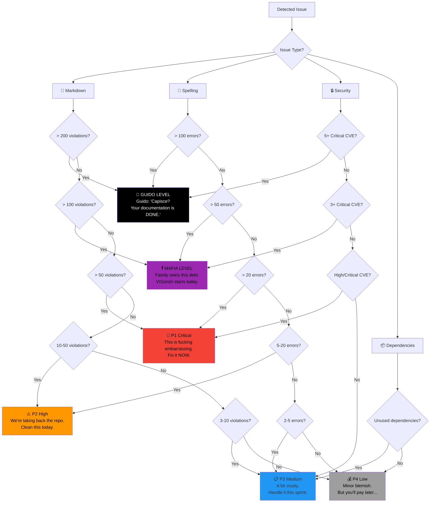
```mermaid
graph TD
    A["Detected Issue"] --> B{"Issue Type?"}
    
    B --> C["📝 Markdown"]
    B --> D["📖 Spelling"]
    B --> E["🔒 Security"]
    B --> F["📦 Dependencies"]
    
    C --> C1{"> 200 violations?"}
    C1 -->|Yes| Z["🤌 GUIDO LEVEL<br/>Guido: 'Capisce?<br/>Your documentation is DONE.'"]
    C1 -->|No| C2{"> 100 violations?"}
    C2 -->|Yes| Y["🕴️ MAFIA LEVEL<br/>Family owns this debt.<br/>VIGorish starts today."]
    C2 -->|No| C3{"> 50 violations?"}
    C3 -->|Yes| G["🚨 P1 Critical<br/>This is fucking embarrassing.<br/>Fix it NOW."]
    C3 -->|No| C4{"10-50 violations?"}
    C4 -->|Yes| H["⚠️ P2 High<br/>We're taking back the repo.<br/>Clean this today."]
    C4 -->|No| C5{"3-10 violations?"}
    C5 -->|Yes| I["📋 P3 Medium<br/>A bit crusty.<br/>Handle it this sprint."]
    C5 -->|No| J["💰 P4 Low<br/>Minor blemish.<br/>But you'll pay later..."]
    
    D --> D1{"> 100 errors?"}
    D1 -->|Yes| Z
    D1 -->|No| D2{"> 50 errors?"}
    D2 -->|Yes| Y
    D2 -->|No| D3{"> 20 errors?"}
    D3 -->|Yes| G
    D3 -->|No| D4{"5-20 errors?"}
    D4 -->|Yes| H
    D4 -->|No| D5{"2-5 errors?"}
    D5 -->|Yes| I
    D5 -->|No| J
    
    E --> E1{"5+ Critical CVE?"}
    E1 -->|Yes| Z
    E1 -->|No| E2{"3+ Critical CVE?"}
    E2 -->|Yes| Y
    E2 -->|No| E3{"High/Critical CVE?"}
    E3 -->|Yes| G
    E3 -->|No| I
    
    F --> F1{"Unused dependencies?"}
    F1 -->|Yes| I
    F1 -->|No| J
    
    style Z fill:#000000,color:#ffffff
    style Y fill:#9c27b0,color:#000000
    style G fill:#f44336,color:#000000
    style H fill:#ff9800,color:#000000
    style I fill:#2196f3
    style J fill:#9e9e9e,color:#000000
```

---

## 📦 Project Initialization

### **How `refuctor init` Sets Up Projects**

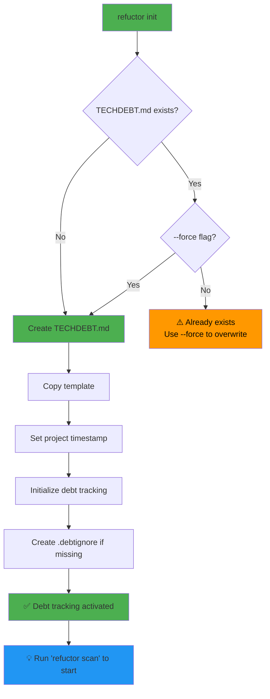
```mermaid
flowchart TD
    A["refuctor init"] --> B{"TECHDEBT.md exists?"}
    B -->|Yes| C{"--force flag?"}
    B -->|No| D["Create TECHDEBT.md"]
    
    C -->|Yes| D
    C -->|No| E["⚠️ Already exists<br/>Use --force to overwrite"]
    
    D --> F["Copy template"]
    F --> G["Set project timestamp"]
    G --> H["Initialize debt tracking"]
    H --> I["Create .debtignore if missing"]
    I --> J["✅ Debt tracking activated"]
    J --> K["💡 Run 'refuctor scan' to start"]
    
    style A fill:#4caf50
    style D fill:#4caf50
    style E fill:#ff9800,color:#000000
    style J fill:#4caf50
    style K fill:#2196f3
```

---

## 🎭 Personality System

### **Snarky Message Generation**

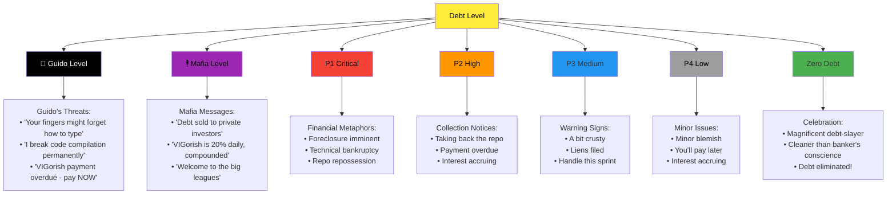
```mermaid
graph TD
    A["Debt Level"] --> Z["🤌 Guido Level"]
    A --> Y["🕴️ Mafia Level"]
    A --> B["P1 Critical"]
    A --> C["P2 High"]
    A --> D["P3 Medium"] 
    A --> E["P4 Low"]
    A --> F["Zero Debt"]
    
    Z --> Z1["Guido's Threats:<br/>• 'Your fingers might forget how to type'<br/>• 'I break code compilation permanently'<br/>• 'VIGorish payment overdue - pay NOW'"]
    Y --> Y1["Mafia Messages:<br/>• 'Debt sold to private investors'<br/>• 'VIGorish is 20% daily, compounded'<br/>• 'Welcome to the big leagues'"]
    B --> B1["Financial Metaphors:<br/>• Foreclosure imminent<br/>• Technical bankruptcy<br/>• Repo repossession"]
    C --> C1["Collection Notices:<br/>• Taking back the repo<br/>• Payment overdue<br/>• Interest accruing"]
    D --> D1["Warning Signs:<br/>• A bit crusty<br/>• Liens filed<br/>• Handle this sprint"]
    E --> E1["Minor Issues:<br/>• Minor blemish<br/>• You'll pay later<br/>• Interest accruing"]
    F --> F1["Celebration:<br/>• Magnificent debt-slayer<br/>• Cleaner than banker's conscience<br/>• Debt eliminated!"]
    
    style A fill:#ffeb3b,color:#000000
    style Z fill:#000000,color:#ffffff
    style Y fill:#9c27b0,color:#000000
    style B fill:#f44336,color:#000000
    style C fill:#ff9800,color:#000000
    style D fill:#2196f3
    style E fill:#9e9e9e,color:#000000
    style F fill:#4caf50
```

---

## 🚀 Complete Development Timeline - All Phases

### **Full Project Roadmap & Timeline**

```mermaid
gantt
    title Refuctor Complete Development Timeline
    dateFormat  YYYY-MM-DD
    
    section PHASE 1 ✅ COMPLETE
    Basic Commands         :done, p1_basics, 2024-12-28, 2025-01-01
    Debt Detection        :done, p1_detection, 2025-01-01, 2025-01-02
    Goon Tools           :done, p1_goons, 2025-01-02, 2025-01-03
    Debt Ignore System   :done, p1_ignore, 2025-01-03, 2025-01-03
    Documentation        :done, p1_docs, 2025-01-03, 2025-01-03
    NPM Package Prep     :active, p1_npm, 2025-01-03, 2025-01-04
    
    section PHASE 2 📋 GUI Dashboard (Weeks 5-8)
    Electron App Setup    :p2_electron, 2025-01-15, 2025-01-22
    Dashboard UI         :p2_ui, 2025-01-22, 2025-01-29
    Interactive Controls :p2_controls, 2025-01-29, 2025-02-05
    AI Integration       :p2_ai, 2025-02-05, 2025-02-12
    
    section PHASE 3 📋 MCP Integration (Weeks 9-12)
    MCP Server Setup     :p3_server, 2025-02-12, 2025-02-19
    Cross-Workspace Sync :p3_sync, 2025-02-19, 2025-02-26
    AI Assistant Hooks   :p3_hooks, 2025-02-26, 2025-03-05
    Team Coordination    :p3_team, 2025-03-05, 2025-03-12
    
    section PHASE 4 📋 Specialized Tools (Weeks 13-16)
    Advanced Goons       :p4_goons, 2025-03-12, 2025-03-19
    Accountant Module    :p4_accountant, 2025-03-19, 2025-03-26
    The Fixer & Detective  :p4_support, 2025-03-26, 2025-04-02
    Build Integration    :p4_build, 2025-04-02, 2025-04-09
    
    section PHASE 5 📋 Professional Grade (Weeks 17-20)
    Enterprise Features  :p5_enterprise, 2025-04-09, 2025-04-16
    CI/CD Integration    :p5_cicd, 2025-04-16, 2025-04-23
    IDE Extensions       :p5_ide, 2025-04-23, 2025-04-30
    Business Model       :p5_business, 2025-04-30, 2025-05-07
```

---

## 📊 Complete Project Status & Metrics

### **Phase Completion Status**

| **Phase** | **Status** | **Key Deliverables** | **Timeline** |
|-----------|------------|---------------------|--------------|
| **Phase 1** | ✅ COMPLETE | CLI Foundation (11 commands), Goon System, Documentation | Weeks 1-4 |
| **Phase 2** | 📋 PLANNED | Electron GUI, Real-time Dashboard, Interactive Controls | Weeks 5-8 |
| **Phase 3** | 📋 PLANNED | MCP Integration, Cross-Workspace Sync, AI Hooks | Weeks 9-12 |
| **Phase 4** | 📋 PLANNED | Advanced Goons, Accountant, The Fixer, Detective | Weeks 13-16 |
| **Phase 5** | 📋 PLANNED | Enterprise Features, CI/CD, IDE Extensions | Weeks 17-20 |

### **Current Implementation Metrics**

**✅ PHASE 1 COMPLETE:**
- **Commands**: 11/11 ✅ COMPLETE  
- **Core Modules**: 4/4 ✅ COMPLETE  
- **Goon Tools**: 1/6 specialized tools (fix-markdown working)  
- **Debt Categories**: P1-P4 system ✅ COMPLETE  
- **Ignore System**: Professional .debtignore ✅ COMPLETE  
- **Testing**: Self-validated (recursive debt management) ✅  
- **Documentation**: Complete visual roadmap ✅  

**📋 UPCOMING PHASES:**
- **Phase 2**: GUI Dashboard with Electron framework
- **Phase 3**: MCP Server integration for cross-workspace coordination  
- **Phase 4**: Complete Debt Collection Agency (Goons + Accountant + The Fixer + Detective)
- **Phase 5**: Enterprise features, CI/CD integration, business model

### **Success Metrics Targets**

- **10,000+ NPM downloads** in first 6 months
- **Cursor IDE official extension** partnership
- **Zero debt status** achieved by 1,000+ developers  
- **Community adoption** with 500+ GitHub stars
- **$75,000 ARR** by end of year 1

---

**"Refactor or Be Repossessed!"** - *The Debt Cleansing Syndicate*

*Making technical debt management actually understandable for humanzees since 2025.*

*Complete visual roadmap with proper phase notation - because even developers need pictures to understand complex systems.*